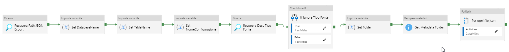

# Migrazione EDWH - Acquisizione iniziale

Obiettivo della migrazione sarà quello di trasferire tutti i dati presenti in Teradata on premise nel cloud impiegando il nuovo strumento di DataWareHouse SYNAPSE analytics, disponibile come strumento SaaS sulla piattaforma Azure.

Il processo di migrazione, data la quantità di dati presenti, prevede diverse fasi legate all'obiettivo di cambio piattaforma. Una prima fase di generazione memorizzazione delle strutture dati Teradata che, con l'ausilio di strumenti di migrazione specifici, creerà le stesse tabelle in Synapse, con le opportune variazioni di tipo e caratteristiche.


## 1. Processo Generale

La procedura di acquisizione iniziale dei dati nelle tabelle **Synapse** è suddivisa nelle seguenti macro attività:

- ***Fase di Estrazione Struttura***: estrae la struttura **Teradata** delle tabelle 

- ***Fase di Estrazione Dati***: estrae i dati dalle tabelle **Teradata**

- ***Fase di Caricamento Dati***: carica i dati estratti all'interno di **Synapse** e ne verifica il contenuto

  

L'immagine riportata qui sotto visualizza il contenuto delle singole fasi:


## 2. Estrazione della struttura

#### 2.1 Configurazione Ambiente di Migrazione

Come anticipato nel paragrafo precedente, è necessaria una fase di configurazione dell'ambiente di migrazione che consiste nel definire l'elenco delle tabelle da esportare in **Synapse**, importarne la struttura dati dalla sorgente **Teradata** e verificarne il corretto caricamento sul database **MigrazioneEDWH**.


### 2.1 Censimento delle tabelle da migrare

Per censire una tabella da migrare richiamare la Stored Procedure **Sp_TD_EsecuzioniMigrazione_InsertAnaTabelle** passandogli i parametri ***DatabaseName*** e ***TableName***, come mostrato nell'esempio sotto.


```sql
DECLARE @RC INT
DECLARE @DatabaseName NVARCHAR(50)
DECLARE @TableName NVARCHAR(100)

SET @DatabaseName = 'EDW_DW_SDP'
SET @TableName = 'EDW_TDD_TBGIOOPER'

EXECUTE @RC = [dbo].[Sp_TD_EsecuzioniMigrazione_InsertAnaTabelle] 
   @DatabaseName
  ,@TableName
GO
```


La Stored eseguirà una **INSERT** nella tabelle **TD_AnaTabelle**, generando un ID univoco per ciascuna tabella (*UNIQUEIDENTIFIER*) e imposterà il flag **"Is_Da_Migrare"** a 1: in questo modo,  si definisce che la tabella appena inserita in anagrafica deve ancora essere migrata su Sy

> *Per l'automatismo prevedere l'uso di uno script di esecuzione massivo e/o pipeline di inizializzazione* 


### 2.2 Scarico dei metadati delle tabelle tramite Pipeline Azure Data Factory

Per ciascuna tabella censita è necessario scaricare i metadati da **TERADATA** al fine di mapparli sul database di migrazione.

Questa operazione è implementata nella pipeline Data Factory **pl_TD_MigrazioneEDWH_Scarica_Metadati_Tabella_Auto** che si trova sotto la cartella ***MigrazioneEDWH/Infasamento_Iniziale***.

La *Pipeline* esegue una **SELECT** sulla tabella **TD_AnaTabelle**:

```sql
SELECT 
	 TD_AnaTabelle_ID
	,DatabaseName,TableName
FROM 
	[dbo].[TD_AnaTabelle]
WHERE 
	Is_Da_Migrare = 1
```


Per ciascuna tabella da migrare, restituita dalla query sopra, viene quindi eseguito il Package **SSIS** (*SSIS_Migrazione_RecuperaMetadatiTabella/Package.dtsx*) il quale valorizza la tabella **TD_AnaMetaCampi** elencando tutti i campi di ciascuna tabella, i relativi formati (**TERADATA**), lunghezza e lunghezza massima.


### 2.3 Verifica del corretto inserimento dei metadati

Conclusa la Pipeline di importazione dei metadati, è possibile verificare sul database di migrazione il corretto inserimento degli stessi, eseguendo una query sulla tabella **TD_AnaMetaCampi**, come mostrato nell'esempio a seguire:

```sql
-- Estrazione di tutti i record relativi alle tabelle da Migrare.
SELECT 
    *
FROM
    TD_AnaMetadatiCampi
WHERE 
    ID_Tabella IN
    (
        SELECT 
            TD_AnaTabelle_ID 
        FROM 
            TD_AnaTabelle
        WHERE
            Is_Da_Migrare = 1
    )
```


## 3. Estrazione dei dati

### 3.1 Definizione delle configurazioni

Per ciascuna tabella da migrare è necessario inserire una o più configurazioni che definiscano i seguenti criteri:

- ***Nome campo di rottura***: in caso di tabelle molto grandi sarà necessario frammentare i pacchetti da esportare in modo da non sovraccaricare il sistema. La frammentazione è basata su un campo di rottura che permetta di frammentare logicamente i dati.
- ***Tipo di dato del campo di rottura***: indica il tipo di dato del campo di rottura. Al momento della stesura del presente documento, i tipi di dati gestiti dalla procedura di frammentazione sono *DATE* e *TIMESTAMP*.
- ***Valore inizio e valore fine***: valore di inizio del filtro di frammentazione e valore di fine (data da - a).
- ***Passo***: indica il passo da applicare al filtro. Ad esempio: se il valore inizio è '2012-01-01' e il valore fine è '2012-12-31' e il passo è 180, significa che verranno estratti due frammenti in copertura all'anno di 180 giorni. Il frammento 1 conterrà i dati dal 1° gennaio al 30 giugno e il frammento 2 conterrà il resto dell'anno.
- ***Nome configurazione***: nome descrittivo della configurazione.
- ***Chiave logica***: la chiave logica, in formato *json*, definisce i campi su cui effettuare l'ordinamento dei dati in fase di quadratura. I campi candidati possono essere la chiave della tabella o una sequenza di campi che ne garantiscono l'ordinamento.


Le informazioni sopra elencate devono necessariamente essere valorizzate nel caso di tabelle molto grandi. Nel caso invece di tabelle più piccolo possono essere valorizzati a *NULL* come descritto nella tabella che segue:


| Dimensione tabella | Campo di rottura  | Tipo campo  | Valore inizio | Valore fine  | Passo  | Nome configurazione   | Chiave logica                                |
| ------------------ | ----------------- | ----------- | ------------- | ------------ | ------ | --------------------- | -------------------------------------------- |
| Tabella grande     | `WHEN_REGISTERED` | `TIMESTAMP` | `2014-11-11`  | `2018-10-22` | `365`  | `2014_2018_Passo_365` | `{ "keys" : [ "ID_PARCEL", "TS_ULT_MOD" ] }` |
| Tabella standard   | `NULL`            | `NULL`      | `NULL`        | `NULL`       | `NULL` | `Intera_tabella`      | `{ "keys" : [ "ID_PARCEL", "TS_ULT_MOD" ] }` |


Le configurazioni vengono caricate sul database di Migrazione tramite una Stored Procedure **SP_TD_EsecuzioniMigrazione_ConfigFrammenti** la quale, dato un file *json* in input, ne legge i dettagli e inserisce nella tabella **TD_ConfigFrammenti**. 

La Stored Procedure può essere eseguita inserendo i seguenti parametri:

```sql
DECLARE @RC int
DECLARE @Command varchar(50)
DECLARE @json varchar(max)

SET @json = N'
    {
        "Tabella": "EDW_TDD_TBGIOOPER",
        "Configurazioni":
        [
        {
                "NomeCampoRottura": "DT_CONT",
                "Tipo": "DATE",
                "ValoreInizio": "2020-11-20",
                "ValoreFine": "2020-12-01",
                "Passo": 30,
                "NomeConfigurazione": "EDW_DW_SDP_EDW_TDD_TBGIOOPER_PASSO_30",
                "ChiaveLogica": {
                    "keys": 
                    [
                        "id_operazione"
                    ] 
                }
            }
        ]
    }
';

SET @Command = 'Insert';

EXECUTE @RC = [dbo].[SP_TD_EsecuzioniMigrazione_ConfigFrammenti] 
   @Command
  ,@json
GO
```


Il file *json* di configurazione di una tabella di grandi dimensioni deve essere strutturato come segue:

```json
{
    "Tabella": "EDW_TDD_TBGIOOPER",
    "Configurazioni":
    [
       {
            "NomeCampoRottura": "DT_CONT",
            "Tipo": "DATE",
            "ValoreInizio": "2020-11-20",
            "ValoreFine": "2020-12-01",
            "Passo": 30,
            "NomeConfigurazione": "EDW_DW_SDP_EDW_TDD_TBGIOOPER_PASSO_30",
            "ChiaveLogica": {
                "keys": 
                [
                	"id_operazione"
                ] 
            }
        }
    ]
}
```


Nel caso invece di una tabella standard è sufficiente inserire questi parametri:

```json
{
    "Tabella": "EDW_TDD_UFF",
    "Configurazioni":
    [
       {
            "NomeCampoRottura": null,
            "Tipo": null,
            "ValoreInizio": null,
            "ValoreFine": null,
            "Passo": null,
            "NomeConfigurazione": "EDW_TDD_UFF_INTERA_TABELLA",
            "ChiaveLogica": {
                "keys": 
                [
                	"ts_ulti_conf"
                ] 
            }
        }
    ]
}
```


Una tabella potrà avere più configurazioni ciascuna delle quali caratterizzata dal nome configurazione e, univocamente, dall'ID Configurazione.

La **SP_TD_EsecuzioniMigrazione_ConfigFrammenti** viene eseguita all'interno della Pipeline Data Factory denominata **pl_TD_MigrazioneEDWH_Frammentazione_v01_001_Start** che si trova sotto la cartella ***MigrazioneEDWH/Frammentazione***.


> *Per l'automatismo prevedere l'uso di uno script di esecuzione massivo e/o pipeline di inizializzazione* 


### 3.2 Frammentazione delle tabelle

Una volta definite le configurazioni,  occorre creare i frammenti delle singole tabelle. Nel caso di tabelle di grandi dimensioni verranno creati più frammenti, mentre nel caso di tabella intera vi sarà un unico frammento.

La Stored Procedure **Sp_TD_EsecuzioniMigrazione_FrammentazioneTabella** si occupa di gestire questo passo, dati in input l'**ID_Tabella** (relativo alla tabella ***TD_AnaTabelle***) e l'**ID_Configurazione** (relativo alla tabella ***TD_ConfigFrammenti***):


```sql
DECLARE @RC int
DECLARE @ID_Tabella uniqueidentifier
DECLARE @ID_Configurazione uniqueidentifier

SET @ID_Tabella = 'cadc00cc-99c1-4af5-989a-6be6d529219f';
SET @ID_Configurazione = 'b9e74a89-6db1-47fd-a821-1051cbe1bf57';

EXECUTE @RC = [dbo].[Sp_TD_EsecuzioniMigrazione_FrammentazioneTabella] 
   @ID_Tabella
  ,@ID_Configurazione
GO
```


Il risultato è la creazione dei frammenti all'interno della tabella **TD_AnaFrammentiTabelle**, definendo per ciascun frammento la clausola *WHERE*, ad esempio:

```sql
WHERE DT_CONT >= '2018-05-15' and DT_CONT < '2018-05-17'
```


La **Sp_TD_EsecuzioniMigrazione_FrammentazioneTabella** viene eseguita all'interno della Pipeline Data Factory denominata **pl_TD_MigrazioneEDWH_Frammentazione_v01_002_CreaFrammenti** che si trova sotto la cartella ***MigrazioneEDWH/Frammentazione***.

> *Per l'automatismo prevedere l'uso di uno script di esecuzione massivo e/o pipeline di inizializzazione*


### 3.3 Creazione delle tranches

Il passo successivo consiste nella creazione delle tranches di migrazione per ogni tabella. Anche questo step, come i precedenti, è parte della Pipeline Data Factory **pl_TD_MigrazioneEDWH_Frammentazione_v01_002_CreaFrammenti** che si trova sotto la cartella ***MigrazioneEDWH/Frammentazione***.


In particolar modo, la creazione delle tranches è demandata alla Stored Procedure **Sp_TD_EsecuzioniMigrazione_CreaTranche**  che richiede in ingresso i seguenti parametri:

- **ID_Configurazione**: relativo alla tabella **TD_ConfigFrammenti**

- **ID_Tabella**: relativo alla tabella **TD_AnaTabelle**

- **NumeroFrammenti**:  indica il numero di frammenti voluti per ogni tranche

- **PathOutput**:  il path attualmente è impostatato a  "*/mnt/estrazioniedwhprod/Tranche/*"

- **ID_Tipo_Fonte**: relativo alla tabella **TD_AnaFrammentiTipoFonte**. I valori attuali per questo parametro sono:

  ```
  Tranche di esportazione da Synapse/HC -> F8CC37DE-3E7C-4A9C-BC76-E6900E26C038
  Tranche di esportazione da Teradata   -> C0DAE039-C09A-4298-8550-AE807FB00D0E
  ```


Le tranches, a differenza delle configurazioni e dei frammenti, sono distinte a seconda della fonte dati, come specificato dai parametri della Stored Procedure, e di conseguenza la stessa va eseguita due volte: la prima per creare le traches di estrazione da **Teradata** e la seconda per la creazione delle tranches di esportazione da **Synapse**.

> *Per l'automatismo prevedere l'uso di uno script di esecuzione massivo e/o pipeline di inizializzazione*


## 3.4 Creazione dei json richiesta delle tranches

In questo passo si creano i json di richiesta delle esportazioni dei dati. Se si sta usando la versione fast export sia per Teradata che per Synapse, questo passo va eseguito per entrambe le tipologie, se invece si sta usando la versione fast export solo per Teradata, si dovrà  eseguire solo per il Tipo Fonte Synapse.

Lanciare la pipeline Data Factory **pl_TD_MigrazioneEDWH_Scarica_ElencoJsonTranche** con i seguenti parametri:

**ID_Tipo_Fonte**

*Tranche di esportazione da Synapse/HC -> F8CC37DE-3E7C-4A9C-BC76-E6900E26C038*
*Tranche di esportazione da Teradata       -> C0DAE039-C09A-4298-8550-AE807FB00D0E*

**ID_Configurazione** 

*Relativo alla tabella **TD_ConfigFrammenti***

La pipeline produrrà un file json per ogni tranche della configurazione, questi file sono prodotti attualmente sotto 

*@PathOutput + @Descrizione_Tipo_Fonte + '/' + @DatabaseName + '/' +  @TableName + '/' + @NomeConfigurazione + '/' + @DatabaseName + '' + @TableName +  'Tranche' + cast(@contatore as varchar)  + '' + @Descrizione_Tipo_Fonte + '.json',*

Es. /mnt/estrazioniedwhprod/Tranche/TERADATA/EDW_DW_SDP/EDW_TDD_TBGIOOPER/2020_11_Passo_1/EDW_DW_SDP_EDW_TDD_TBGIOOPER_Tranche_1_TERADATA.json


## 4. Caricamento dei dati

#### **4.1 Estrazione con Fast Export**

Nel caso di esportazione con Fast Export si deve lanciare l'applicazione batch **CreazioneScriptEstrazione** sulla macchina ponte, per eseguire le esportazioni richieste al punto 6.

I parametri in ingresso sono i seguenti :

​		-**ExportCfgFolder** *Path dove risiedono i file json di richiesta (partendo dalla root), ad esempio* *Tranche/TERADATA/EDW\_DW\_SDP/EDW\_TDD\_TBGIOOPER/2020\_11\_Passo\_1*

-**JsonConfigFileName** Il percorso del file di configurazione

​	*C:\RepositoryGIT\_poste-edwh\edwh-on-cloud\Utility\CreazioneScriptEstrazione\ExportEdwhData\Configurazione\ExportEdwhData\_Teradata\_Config.json*

​	Va lanciato per tutti i gile json per cui si vuole eseguire la fast export.

​	**Nota nel caso Tipo fonte Synapse prima dovrà essere stato fatto l'infasamento su Synapse, vedi punto 10**

​	*Per l'automatismo migliorare il path di interscambio dei json tra il punto 6 e il punto 7*


#### 4.2 Importazione degli Esiti

Per l'importazione degli esiti tramite l'utilizzo della fast-export (con tipo fonte *Teradata* o *Synapse*), vanno importati gli esiti prodotti al punto [4.1 Estrazione con Fast Export](#### 4.1 Estrazione con Fast Export) ed inseriti nel container del blob storage di Azure. 

| Azure Storage | Container          |
| :------------ | ------------------ |
| Sviluppo      | dwtemp             |
| Collaudo      | estrazioniedwhprod |
| Produzione    | -                  |

Appena i dati saranno disponibili nel container di riferimento, sarà possibile lanciare la pipeline *pl_TD_MigrazioneEDWH_InserisciResultExport_Configurazione* con i parametri IS_Tipo_Fonte e ID_Configurazione. Per estrarre queste informazioni dovremmo accedere al database di monitoraggio e quindi estrarre l'ID




| ID\_Tipo\_Fonte                       | GUID                                 |
| ------------------------------------- | :----------------------------------- |
| Tranche di esportazione da Synapse/HC | F8CC37DE-3E7C-4A9C-BC76-E6900E26C038 |
| Tranche di esportazione da Teradata   | C0DAE039-C09A-4298-8550-AE807FB00D0E |

| ID\_Configurazione     | GUID                                           |
| ---------------------- | ---------------------------------------------- |
| Estratti dalla tabella | estratti dalla tabella **TD\_ConfigFrammenti** |

In base alla tabella di configurazione potremmo identificare il *TD_ConfigFrammenti_ID* che rappresenta l'identificativo di configurazione.

```sql
-- Visualizzazione del nome del database e della tabella seguiti dai dati della configurazione relativa
select t.DatabaseName, t.TableName, f.TD_ConfigFrammenti_ID 
from 
    TD_ConfigFrammenti f
    inner join TD_AnaTabelle t on t.TD_AnaTabelle_ID = f.ID_Tabella

-- Nel caso si vogliano visualizzare tutti i dati inerenti la configurazione
select t.DatabaseName, t.TableName, f.*
from 
    TD_ConfigFrammenti f
    inner join TD_AnaTabelle t on t.TD_AnaTabelle_ID = f.ID_Tabella
```

Nella pipeline sono presenti alcune variabili di configurazione, che indicano il container e le directory root dove ci si aspetta di trovare i file degli esiti prodotti al punto [4.7 Estrazione con Fast Export](#### 4.7 Estrazione con Fast Export).

> ***Per l'automatismo migliorare il path di interscambio dei json tra il punto 7 e il punto 8***


##### 4.2.1 Controllo

Mano mano che gli esiti vengono inseriti, si può controllare lo stato di avanzamento dell'operazione usando la query di seguito che  volta identificata la configurazione della database e della tabella in importazione sarà possibile richiamare la stored procedure di controllo seguendo le informazioni riportate nell'appendice [5.6 Verifica dello stato di avanzamento dell'operazione di importazione](#### 5.6 Verifica dello stato di avanzamento dell'operazione di importazione).


#### 4.3 Estrazione diretta su Synapse per la verifica

In questa variante i dati per la verifica vengono estratti direttamente da Synapse (Tipo fonte Synapse). In questo caso dopo aver fatto il punto 5 si esegue direttamente il 9 (nota che l'estrazione dei dati che andranno poi infasati su Synapse, Tipo fonte TERADATA, ad oggi passano solo tramite fast export).

Lanciare la pipeline Data Factory *pl\_TD\_MigrazioneEDWH\_Comparazione\_DatiQuadratura\_v01\_001* che richiede il parametro **ID\_Configurazione** da identificare tramite le istruzioni dell'appendice [5.3 Determinazione dell'identificativo configurazione](#### 5.3 Determinazione dell'identificativo configurazione).


La pipeline si occuperà di estrarre i dati per ogni frammento, scrive i file dati sul blob e popola la tabella degli esiti di esportazione (in pratica accorpa i passi 4.6, 4.7, 4.8)

> **Nota che prima dovrà essere stato fatto l'infasamento su Synapse, vedi punto** [4.10 Importazione dei dati su Synapse](#### 4.10 Importazione dei dati su Synapse)


##### 4.3.1 Controllo

Mano mano che gli esiti vengono inseriti, si può controllare lo stato di avanzamento dell'operazione usando la query di seguito che  volta identificata la configurazione della database e della tabella in importazione sarà possibile richiamare la stored procedure di controllo seguendo le informazioni riportate nell'appendice [5.6 Verifica dello stato di avanzamento dell'operazione di importazione](#### 5.6 Verifica dello stato di avanzamento dell'operazione di importazione).


#### 4.4 Importazione dei dati su Synapse

Una volta che i dati sono stati esportati sul blob storage/Data Lake, si possono acquisire nel DataWareHouse di Synapse, lanciando la pipeline del DataFactory *pl\_TD\_MigrazioneEDWH\_LoadTrancheSynapseTables\_Configurazione* con il parametro **ID\_Configurazione** da identificare tramite le istruzioni dell'appendice [5.3 Determinazione dell'identificativo configurazione](####5.3 Determinazione dell'identificativo configurazione).


Nella pipeline/sotto pipeline sono presenti alcune variabili di configurazione, che indicano il container e le directory root dove ci si aspetta di trovare i file degli esiti prodotti al punto  [4.7 Estrazione con Fast Export](#### 4.7 Estrazione con Fast Export).

La pipeline inserirà tutti dati presenti nei frammenti della configurazione passata e popolerà la tabella *TD\_AnaFrammentiTabelleInfIni* contenente gli esiti dell'acquisizione per ogni frammento.


##### 4.4.1 Controllo

Mano mano che gli esiti vengono inseriti, si può controllare lo stato di avanzamento dell'operazione usando la query di seguito che  volta identificata la configurazione della database e della tabella in importazione sarà possibile richiamare la stored procedure di controllo seguendo le informazioni riportate nell'appendice [5.6 Verifica dello stato di avanzamento dell'operazione di importazione](####5.6 Verifica dello stato di avanzamento dell'operazione di importazione).


#### **4.5 Verifica dei dati acquisiti**

Dopo aver inserito i dati su Synapse, potrà essere lanciata una quadratura, per verificare che per ogni frammento i dati estratti da Teradata siano uguali ai dati presenti dentro Synapse. per fare questo è necessario:

1. Aver eseguito fino al punto 10
2. Aver eseguito l'esportazione dei dati di verifica (Tipo Fonte Synapse) tramite i punti 4.6, 4.7, 4.8 oppure 4.9

Lanciare la pipeline Data Factory *pl\_TD\_MigrazioneEDWH\_Verifica\_Congruita\_v01\_001\_For\_Loop\_Main* con il parametro **ID\_Configurazione** da identificare tramite le istruzioni dell'appendice [5.3 Determinazione dell'identificativo configurazione](####5.3 Determinazione dell'identificativo configurazione), ed il parametro **TipoVerifica** con il valore **T-1** per la verifica di acquisizione dei dati iniziale. 

La pipeline verifica tutti i frammenti della configurazione passata e scrive gli esiti nella tabella **TD\_AnaFrammentiTabelleVerifica** . I record relativi ai frammenti inseriti, ma che non hanno superato la verifica, vengono eliminati dalla tabella di Synapse. Nella tabella sono presenti informazioni utilizzabili per comprendere il motivo del mancato esito positivo della verifica.

> *Sarebbe comodo usare anche in questo caso la SP **Sp\_TD\_EsecuzioniMigrazione\_GetStatoFrammentiConfigurazione** , ma attualmente ancora non gestisce l'esito della verifica. **

Attualmente si deve controllare usando le seguenti query, dove @*ID\_Configurazione* è l'identificativo della configurazione utilizzata. 

```sql
SELECT *
FROM 
	dbo.TD\_AnaFrammentiTabelleVerifica
WHERE 
        ID\_Frammento in (
            SELECT TD\_AnaFrammentiTabelle\_ID 
            FROM dbo.TD\_AnaFrammentiTabelle 
            WHERE ID\_Configurazione] = @ID\_Configurazione
        )
    AND ID\_StatoVerifica = 'B38DABDC-A9FF-4D09-9546-F0DA72954AA7';
```

Questa query riporterà tutti i frammenti andati in errore.

```sql
SELECT *
FROM dbo.TD\_AnaFrammentiTabelleVerifica
WHERE 
		ID\_Frammento in (
            SELECT TD\_AnaFrammentiTabelle\_ID FROM dbo.TD\_AnaFrammentiTabelle 
            WHERE ID\_Configurazione = @ID\_Configurazione
        )
	AND ID\_StatoVerifica = '4B12B0E0-FAFF-4DB3-9BF6-E242A672E126';
```

Questa query riporterà tutti i frammenti che hanno superato la verifica.

```sql
SELECT COUNT(*) 
FROM dbo.TD\_AnaFrammentiTabelle 
WHERE ID\_Configurazione = @ID\_Configurazione
```

Questa query riporterà il numero totale dei frammenti della configurazione.


## 5. Appendici

#### 5.1 Accesso al database con Azure Studio

Per l'accesso al database di monitoraggio dovremmo possedere le credenziali di accesso al databse *smllabsql01a.database.windows.net* presente su Azure, al quale la nostra utenza dovrà essere abilitata, e quindi si potrà effettuare la connessione al database di monitoraggio.

Per scaricare il software forniamo il link disponibile al momento della scrittura del presente documento: https://docs.microsoft.com/it-it/sql/azure-data-studio/download-azure-data-studio. Seguire le istruzioni fornite sulla stessa pagina, per effettuare l'installazione.

**Passi necessari**

1. Abilitazione dell'utenza all'accesso alla VPN di Azure
2. Connessione al database Azure SQL

**Strumenti necessari**

Supponendo di accedere tramite gli strumenti forniti direttamente dalla piattaforma Azure, possiamo impiegare Azure Studio per eseguire questa operazione. Esso si presenta come Visual Studio Code, ed ha subito una personalizzazione allo scopo per poter essere impiegato con i database presenti su Azure. Risulta essere sufficientemente leggero e funzionale per l'esecuzione della maggior parte delle operazioni su database Azure SQL. 

Su SYNAPSE invece risulta difficile identificare la tipologia di tabella con la quale andiamo a lavorare. In particolare non esiste al momento della scrittura di questo documento una differenziazione visiva tra le tabelle con distribuzione Round Robin, Replicata o su chiave Hash.

Per effettuare una nuova connessione bisognerà possedere tutte le informazioni necessarie alla connessione, riportate nell'immagine successiva:


##### 5.1.1 Dati di accesso al database di monitoraggio

Dati necessari per effettuare la connessione con utenza abilitata all'accesso:

| Caratteristica         | Contenuto                             |
| ---------------------- | ------------------------------------- |
| Connessione            | Microsoft Sql Server                  |
| Server                 | **smllabsql01a.database.windows.net** |
| Tipo di autenticazione | SQL Login                             |
| Utente                 | posteadmin                            |
| Password               | PostePegasus_1                        |
| Database               | **migrazioneedwh**                    |


##### 5.1.2 Dati di accesso al DataWarehouse di Analytics

Dati necessari per effettuare la connessione con utenza abilitata all'accesso:

| Caratteristica         | Contenuto                             |
| ---------------------- | ------------------------------------- |
| Connessione            | Microsoft Sql Server                  |
| Server                 | **smedwhsql02a.database.windows.net** |
| Tipo di autenticazione | SQL Login                             |
| Utente                 | posteadmin                            |
| Password               | PostePegasus_1                        |
| Database               | **smedwhdwh01a**                      |


#### 5.3 Determinazione dell'identificativo della configurazione

Per identificare l'identificativo di configurazione sarà necessario accedere al database di monitoraggio mano che gli esiti vengono inseriti, si può controllare lo stato di avanzamento dell'operazione usando la query di seguito che in base alla tabella ci permetterà di identificare il *TD_ConfigFrammenti_ID* che conterrà l'identificativo della configurazione.

```sql
-- Visualizzazione del nome del database e della tabella seguiti dai dati della configurazione relativa
select t.DatabaseName, t.TableName, f.TD_ConfigFrammenti_ID 
from 
    TD_ConfigFrammenti f
    inner join TD_AnaTabelle t on t.TD_AnaTabelle_ID = f.ID_Tabella
```

con un esempio di risultato:


#### 5.4 Determinazione della configurazione applicata alla tabella

```sql
-- Nel caso si vogliano visualizzare tutti i dati inerenti la configurazione
select t.DatabaseName, t.TableName, f.*
from 
    TD_ConfigFrammenti f
    inner join TD_AnaTabelle t on t.TD_AnaTabelle_ID = f.ID_Tabella
```

con il seguente risultato:


#### 5.5 Accesso allo Azure storage

Per accedere allo spazio condiviso atto a ospitare i file di interscambio ed alimentare il DataLake e successivamente il DataWareHouse, utilizzeremo lo Azure Storage Explorer, appositamente pensato come Azure Data Studio per accedere direttamente alla rete interna di Azure e a tutte le risorse che non sono esposte su internet. Per poter utilizzare questo ambiente si dovrà scaricarlo o da Azure.


##### 5.5.1 Accesso allo storage di collaudo

| Caratteristica           | Contenuto                                                    |
| ------------------------ | ------------------------------------------------------------ |
| Server                   | smedwhsa01a                                                  |
| Chiave di autenticazione | yVCCkgnftQlHao4hFGPBEbU49A0kBZWkzbQUZThaDYKtv1IOU45BL4hCYxTWALmHUTvTUMUuc/sUAr04zkmGxQ== |


##### 5.5.2 Accesso allo storage di sviluppo

| Caratteristica           | Contenuto                                                    |
| ------------------------ | ------------------------------------------------------------ |
| Server                   | **smllabsa01a**                                              |
| Chiave di autenticazione | XivFB8KFfM4kDtDAqKVpNtFkUpMzGLkJ3Td72Db1LKKpxs85apm2IkxmgaNUxVt7h+K3HPTxwrSdpzmEWlGqXg== |


##### 5.5.3 Container utilizzati per la migrazione

| Azure Storage | Container          |
| :------------ | ------------------ |
| Sviluppo      | dwtemp             |
| Collaudo      | estrazioniedwhprod |
| Produzione    | -                  |


#### 5.6 Verifica dello stato di avanzamento dell'operazione di importazione

Per verificare lo stato di avanzamento dell'operazione di importazione possiamo impiegare il codice seguente:

```sql
execute Sp_TD_EsecuzioniMigrazione_GetStatoFrammentiConfigurazione @ID_Configurazione = '3ddea8de-1734-4386-a78b-00081da1360b'
```

la quale restituirà una informazione del seguente tipo.


A questa stored dovremo cambiare l'identificativo di configurazione ed inserire quello della tabella su cui stiamo agendo.

